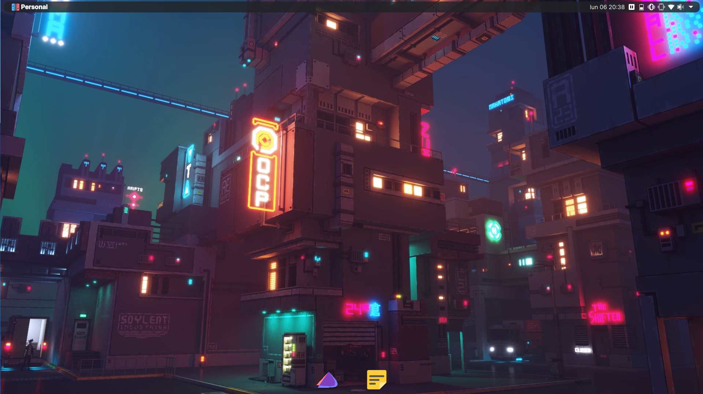
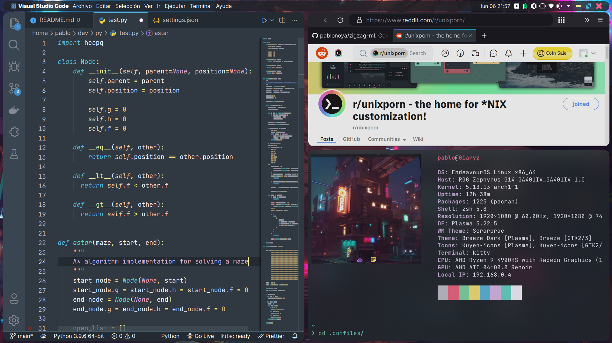

# Dotfiles

Just my personal dotfiles.

## Installation

You can use [dotbot](https://github.com/anishathalye/dotbot) to symlink the files. Clone this repo and run `./install`.

### Plasma files

Import `plasma/plasma.tar.gz` using [Plasma Customization Saver](https://store.kde.org/p/1298955/)

## Theme

- Panel: [Latte](https://github.com/KDE/latte-dock)
- Terminal: [Kitty](https://sw.kovidgoyal.net/kitty/)
- Wallpaper: [Cityscape Cyberpunk live wallpaper](https://mylivewallpapers.com/sci-fi/cityscape-cyberpunk-live-wallpaper/)
- Icons: [Küyen](https://github.com/fabianalexisinostroza/Kuyen-icons)
- Plasma Theme: Noc from [Noc and Lux](https://store.kde.org/p/1187841/)
- VS code theme: [seramuriana](https://github.com/pablonoya/seramuriana) (colors also in plasma and kitty)
- Rounded corners: [ShapeCorners](https://github.com/khanhas/ShapeCorners)
- Tiling: [Kröhnkite](https://github.com/esjeon/krohnkite)

Latte layout and firefox css must be copied from `plasma/latte/` and `firefox/` directories
